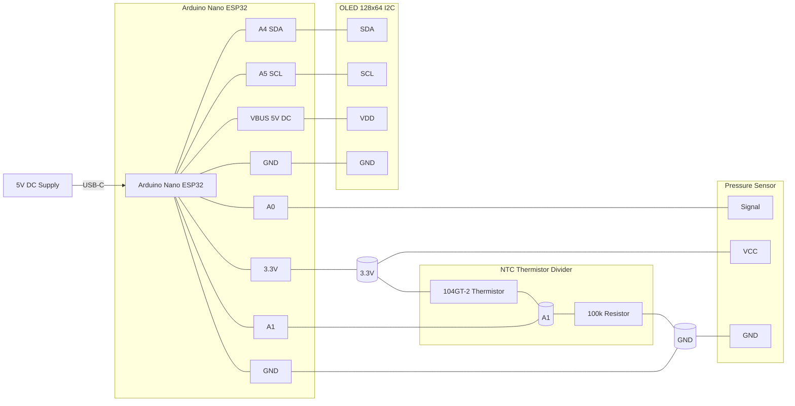

# Dedicuino Reimplementation — Hardware Wiring Diagram

> **Note**: This is a reimplementation of the [original DeLonghi Dedica modification by CaiJonas](https://github.com/CaiJonas/DeLonghi-Dedica-EC885-EC685-modification/), adapted for Arduino Nano ESP32 with 3.3V sensor architecture and USB-C power.

This wiring uses an Arduino Nano ESP32, I2C OLED, analog pressure sensor, and an analog NTC thermistor (ATC Semitec 104GT-2).

## Pin Mapping

| Component | Signal | Arduino Nano ESP32 Pin |
|---|---|---|
| OLED (128x64, I2C) | SDA | A4 |
| OLED (128x64, I2C) | SCL | A5 |
| OLED (128x64, I2C) | VDD | VBUS |
| OLED (128x64, I2C) | GND | GND |
| Pressure Sensor | OUT | A0 |
| Pressure Sensor| VCC | 3.3V |
| Pressure Sensor| GND | GND |
| Thermistor (ATC Semitec 104GT-2) | One end | 3.3V |
| Thermistor (ATC Semitec 104GT-2) | Other end (sense node) | A1 |
| Resistor 100k (fixed divider resistor) | One end (sense node) | A1 |
| Resistor 100k (fixed divider resistor) | Other end | GND |
| Power Supply (5V DC) | Input | USB-C |

> Important: power the board via USB-C (5V input). Keep all sensor signals within 0–3.3V at the ADC pins.

## Functional Schematic (Mermaid)

## Detailed Connection Guide

### 🖥️ OLED Display (I2C)
- **SDA** → Arduino **A4**
- **SCL** → Arduino **A5**
- **GND** → Arduino **GND**
- **VCC** → Arduino **VBUS** (5V from USB)

### 🌡️ Thermistor (ATC Semitec 104GT-2) & Voltage Divider
- **Thermistor**:
  - One end → Arduino **3.3V**
  - Other end → Arduino **A1**
- **100kΩ Resistor**:
  - One end → Arduino **A1**
  - Other end → Arduino **GND**

### 📈 Pressure Sensor
- **VCC** → Arduino **3.3V**
- **GND** → Arduino **GND**
- **SIGNAL** → Arduino **A0**

### ⚡ Power Supply
- **USB-C** → Arduino **USB-C port** (5V input)

> ⚠️ **Note**: Sensors are powered from **3.3V rail**, not 5V. OLED uses **VBUS (5V)** for proper brightness. After switching to 3.3V sensors, recalibration is required.

## Wiring Checklist

- Shared ground between **all** modules.
- Keep analog sensor wires short and routed away from high-voltage lines.
- If readings are noisy, add a small RC filter on A0/A1 (e.g., 1k + 100nF) near the Nano ESP32.
- If the pressure sensor is powered from 3.3V, its output span is typically lower than at 5V; re-calibrate pressure conversion in firmware.
